<!-- Banner -->
<div align="center">
  
</div>

<!-- Personal Badges Row -->
<div align="center">


</div>

<!-- About Me in TypeScript style -->
```typescript
// artem.ts
class Artem extends Human {
  name = "Artem Semenihin";
  age = 14; // born 07.12.2010
  from = "Lipetsk, Russia";
  personality = ["quiet introvert", "deep conversations only", "real friendships > fake followers"];
  energy = "high when focused, calm when creating";
  os = "Arch Linux btw";
  editor = "VS Code";
  
  loves = [
    "experimenting", "Blender", "parkour", "calisthenics", "climbing",
    "building insane Minecraft creations", "cold showers", "Linux ricing",
    "Dragon Ball", "The Flash", "Magnus Midtbø", "Browney", "business history"
  ];
  
  hates = ["TikTok", "social media addiction", "fake people", "lust", "distractions"];
  
  languages = {
    russian: "Native",
    english: "B2",
    norwegian: "just started – hei på deg!"
  };
  
  dream() {
    return "Fullstack Developer → Move to Norway → Build things that matter";
  }
}

const me = new Artem();
console.log(me.dream());
```

> **Discipline. Growth. Real connections.**  
> 14-year-old building the future one commit at a time.

<br>

<!-- Norway Quest -->
### 🇳🇴 Norway Quest – Level 2 / 10

```mermaid
graph LR
    A[Level 1: Started Norwegian] --> B[Level 2: Web Dev Basics]
    B --> C[Level 3: First Job/Freelance]
    C --> D[Level 10: Living in Norway 🏔️]
    style A fill:#A3BE8C,stroke:#A3BE8C
    style B fill:#A3BE8C,stroke:#A3BE8C
    style C fill:#3B4252
    style D fill:#3B4252
```


<br>

### 👨🏻‍💻 Languages & Tools
<div align="center">


</div>

**Learning path:** Following [roadmap.sh/full-stack](https://roadmap.sh/full-stack)  
**Next milestones:** Node.js → React → TypeScript → Backend (Node/Express or Go)

<br>

### 🚀 Current Journey
- Mastering HTML / CSS / JS (freecodecamp + YouTube + docs)
- Building real projects (portfolio, tools, Discord bots)
- Daily coding streak since 2024
- Learning by doing – no tutorials without shipping something

**Bro since kindergarten:** [@vlp0werr](https://github.com/vlp0werr) – same mission, same grind 💪

<br>

### 📊 GitHub Stats
<div align="center">
  
  
</div>

<div align="center">
  
</div>

<br>

### ⏰ WakaTime – Proof of Grind
<div align="center">
  
</div>

<br>

### 🤝 Connect With Me
<div align="center">

[](https://discord.gg/DwrxkdJdUC)
[](https://t.me/artplay254)
[](mailto:artplay254@gmail.com)

</div>

<br>

<div align="center">
  <i>No noise. Just building.</i><br>
  
</div>

<!-- Footer wave -->
<div align="center">
  
</div>
