<div align="center">


[](https://archlinux.org/)
[](#)
[](https://wakatime.com/@artplay254)
[](https://discord.gg/DwrxkdJdUC)
[](#)


</div>

---

## `const aboutMe = {`

```javascript
  name: "Artem Semenihin",
  age: 15,
  location: "Lipetsk, Russia → Europe (soon)",
  targetDestination: "Norway",
  personality: ["introvert", "curious", "disciplined", "honest", "deep-thinker"],
  
  philosophy: {
    approach: "Hard paths make strong people",
    motto: "Get up and keep going, no matter how many times you fall",
    values: ["truth", "real friendships", "self-improvement", "respect"],
    rejects: ["fake people", "shortcuts", "laziness", "mediocrity"]
  },
  
  dailyLife: {
    os: "Arch Linux + KDE Plasma",
    drinks: "Only water (occasionally other)",
    habits: ["5 AM wake-ups", "cold showers", "workouts", "clean eating"],
    badHabits: []
  },
  
  interests: [
    "Mathematics & Physics",
    "Linux & PC Hardware", 
    "Calisthenics & Parkour",
    "Deep universe theories",
    "Building & Creating"
  ],
  
  currentMission: "Master web development → Build portfolio → Work remotely in Europe",
  journeyStartDate: "January 1, 2026",
  finalGoal: "Living peacefully in Europe (2032-2035)"
};
```

## `}`

---

<div align="center">

## 🎯 **Current Focus**

**Officially starting my coding journey on January 1st, 2026**

Learning the foundations of web development while staying physically and mentally strong

</div>

---

## 🚀 Q1 2026 Goals

- [ ] Get FreeCodeCamp Responsive Web Design Certification
- [ ] Build 10 portfolio projects
- [ ] Contribute to open source
- [ ] Master HTML, CSS, JavaScript fundamentals
- [ ] Launch Discord community to 100+ members
- [ ] Reach 100 hours of coding (WakaTime)

---

## 🗺️ Europe Quest

```mermaid
graph TD
    A[🎓 Level 1: Finish School Strong] --> B[📚 Level 2: College/University]
    B --> C[💻 Level 3: Self-Learn Coding]
    C --> D[💼 Level 4: Start Freelancing/Remote Work]
    D --> E[📦 Level 5: Build Strong Portfolio]
    E --> F[🎯 Level 6: Apply to Full-Time Remote Jobs in Europe]
    F --> G[✈️ Level 7: Travel Across Europe]
    G --> H[🏔️ Level 8: Decide on Country]
    H --> I[🏡 Final Level: Move & Live Peacefully]
    
    style A fill:#5E81AC,stroke:#4C566A,color:#ECEFF4
    style B fill:#5E81AC,stroke:#4C566A,color:#ECEFF4
    style C fill:#5E81AC,stroke:#4C566A,color:#ECEFF4
    style D fill:#81A1C1,stroke:#4C566A,color:#ECEFF4
    style E fill:#81A1C1,stroke:#4C566A,color:#ECEFF4
    style F fill:#88C0D0,stroke:#4C566A,color:#2E3440
    style G fill:#88C0D0,stroke:#4C566A,color:#2E3440
    style H fill:#A3BE8C,stroke:#4C566A,color:#2E3440
    style I fill:#A3BE8C,stroke:#4C566A,color:#2E3440
```

<details>
<summary><b>Click to view my journey to Europe</b></summary>

<br>



**Current Level:** Level 1 (9th grade)  
**Target Completion:** 2032-2035  
**Why Norway?** Beautiful nature, clean air/water, peaceful culture, work-life balance, freedom to explore Europe

</details>

---

## 📊 Coding Stats

<div align="center">

[](https://wakatime.com/@72b1c550-60d3-405b-ac99-8959268a85f2)

[](https://wakatime.com/@artplay254)

</div>

---

## 🛠️ Tech Stack & Environment

### 📚 Currently Learning


### 💻 Daily Environment


**AI Tools:**  


### 🎯 Next on Roadmap

<details>
<summary><b>Full Stack Developer Path (roadmap.sh)</b></summary>

<br>

**Frontend:**
- React.js
- TypeScript
- Tailwind CSS
- Next.js

**Backend:**
- Node.js
- Express.js
- RESTful APIs
- Authentication & Authorization

**Database:**
- PostgreSQL
- MongoDB

**DevOps & Tools:**
- Docker
- Linux Server Management
- CI/CD Pipelines
- Cloud Services (AWS/DigitalOcean)

</details>

---

## 🎨 Featured Projects

> 🚧 **Projects in Progress** — Building my portfolio from scratch, one project at a time

*Coming soon: 10 portfolio projects showcasing HTML, CSS, JavaScript fundamentals*

Stay tuned for updates as I build real-world projects starting January 2026!

---

<details>
<summary><b>🧠 What Drives Me</b></summary>

<br>

I'm not your average 15-year-old. While most people my age are scrolling TikTok and wasting their potential, I'm:

- **Waking up at 5 AM** for cold showers and workouts
- **Running Arch Linux** because I value freedom, power, and control
- **Choosing hard paths** because easy ones don't build character
- **Learning English through immersion** (B2 level, thinking in English)
- **Staying disciplined** with clean eating, no bad habits, active lifestyle
- **Building real friendships** that last over 10 years

I experimented with everything since age 12: Blender, video editing, Arduino, parkour, calisthenics, martial arts, business planning, PC building, and more. Now I'm focused on **coding** — my path to freedom and Europe.

I don't follow trends. I build myself into something **exceptional**.

**Inspirations:** Dragon Ball (keep going no matter what), Stan Browney, Magnus Midtbø, Sergio Nee

</details>

---

<details>
<summary><b>🤝 The Brotherhood</b></summary>

<br>

Shoutout to my bro **Vlad** ([@vlp0werr](https://github.com/vlp0werr)) — we've been together since kindergarten, over 10 years of true friendship. We share the same goal: **Europe**. We're building ourselves together, pushing each other to be better every single day.

Real friendships are rare. This is one of them.

</details>

---

<details>
<summary><b>💪 Beyond Coding</b></summary>

<br>

I believe in balance. While I'm building my coding skills, I'm also:

- **Staying physically strong:** Calisthenics, parkour, workouts, sports (volleyball, soccer, basketball)
- **Staying mentally sharp:** Mathematics, physics, deep conversations about the universe
- **Staying disciplined:** Clean eating, water-only drinking, no bad habits
- **Challenging myself:** Taking harder paths, swapping easy tasks for difficult ones

**Health = Wealth.** A strong body supports a strong mind.

</details>

---

<details>
<summary><b>🎯 My Philosophy</b></summary>

<br>

```javascript
const myPhilosophy = {
  truth: "I tell it like it is, even if it's uncomfortable",
  standards: "Filters, boundaries, and high standards keep me surrounded by quality people",
  discipline: "Discipline > Motivation. Always.",
  growth: "Choose the hard path. It makes you stronger.",
  authenticity: "No fake people, no fake friendships, no fake life"
};

// I respect everyone, but I don't tolerate mediocrity in my circle
```

</details>

---

## 🌐 Connect With Me

<div align="center">

[](https://discord.gg/DwrxkdJdUC)
[](https://t.me/artplay254)
[](mailto:artplay254@gmail.com)
[](https://github.com/artplay254)
[](https://wakatime.com/@artplay254)

**Join my Discord community** — building a space for people with the same mindset: disciplined, ambitious, real.

</div>

---

<div align="center">

### 💭 One Last Thing

> *"I'm building myself into someone exceptional — intellectually, physically, and morally. Not because it's easy, but because it's worth it."*

**The journey starts January 1st, 2026. Let's go.**

---


</div>